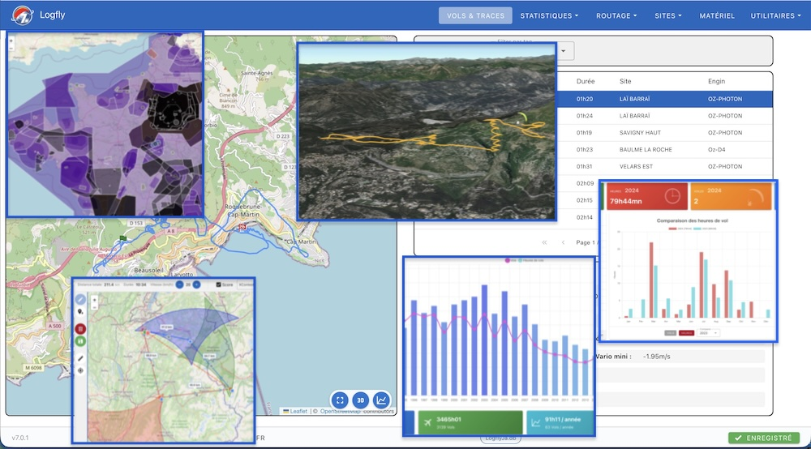

# logfly-web

Logfly is a software dedicated to paragliding flights. Version 7 has undergone a significant change: after six versions in desktop application installable on Windows, macOS, and Linux, Logfly is now a web application directly accessible from the browser.

Logfly is loaded from the server, but during execution, there is no longer any connection to the server. They are stored on the computer and never leave it. This allows for back-compatibility with previous versions.

It has numerous modules: flight analysis, flight log management, statistics, cross planners, airspace management, equipment management, etc...



It can be used without creating a logbook.

It allows storing, visualizing, and evaluating GPS-tracked flight records. It is possible to add flights without GPS tracking.

The flight logbook is easily updated by automatically detecting takeoff times. It provides precise flight statistics for the year, month, etc...

A large number of GPS devices are supported: Flytec/Braüniger, Flymaster, Reversale, Skytraxx, Syride, Oudie, XC Tracer... It can also import tracks from disk, USB key, or microSD card.

Each track can be evaluated according to French CFD rules or other challenges like XC Contest. On a full-screen map, Logfly displays an analysis of thermals and transitions.

The XCNav module allows preparing cross-country itineraries.

The Waypoints module allows managing waypoint files.


### Built With
* [Vite](https://vitejs.dev/)
* [Vue](https://vuejs.org/)
* [Vuetify](https://vuetifyjs.com/)
* [sql.js](https://github.com/sql-js/sql.js)
* [Leaflet](https://github.com/Leaflet/Leaflet)

### Credits
- [Tom Payne](https://github.com/twpayne) the first paragliding softwares developer
- [Tobias Bieniek](https://github.com/Turbo87/igc-parser) for his great igc parser
- [Momtchil Momtchev](https://github.com/mmomtchev) for the fantastic scoring module
- [Torben Brams](https://github.com/tbrams/OpenAirJS) for the OpenAir parser 
- [Victor Berchet](https://github.com/vicb/flyXC) for his great project FlyXC
- [Sylvain Pasutto](https://github.com/spasutto/test-igc-xc-score/tree/master) for his map point and click score tool 

## Project Setup

```sh
npm install
```

### Compile and Minify

```sh
npm run build
```
